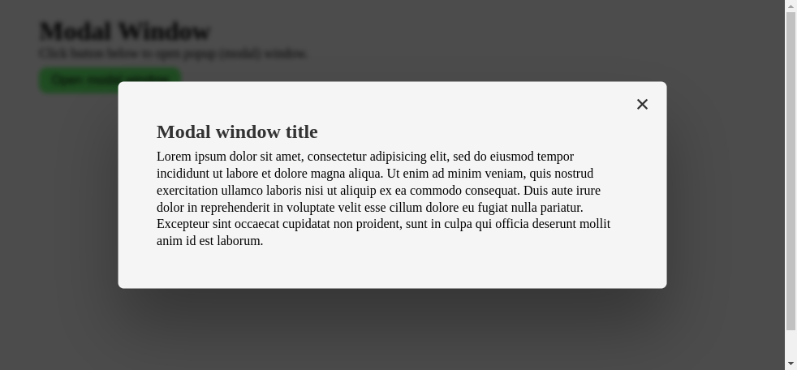

# Modal (Popup) Window

Display modal window.

## Features

- display modal (popup) window
- modal window contains overlay that blurs rest of the page
- modal window consists of header, body and footer sections
- close window by clicking on "x" button (close button)
- close window by clicking on onverlay
- close window by pressing ESCAPE key on keyboard

## Technologies used

- HTML
- CSS
- JavaScript

## Preview

Live demo: [click here](https://pawelpohland.github.io/modal-window/)

